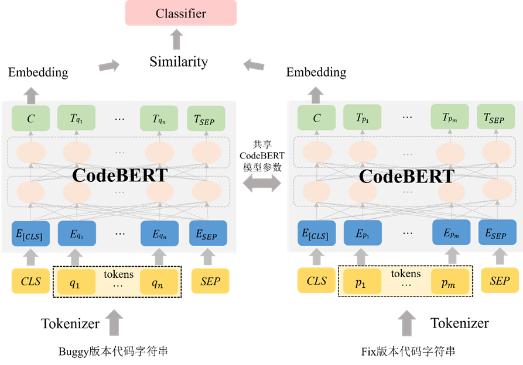
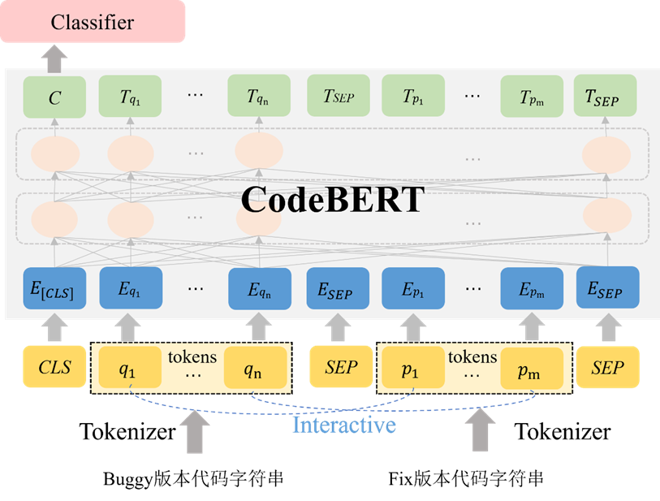
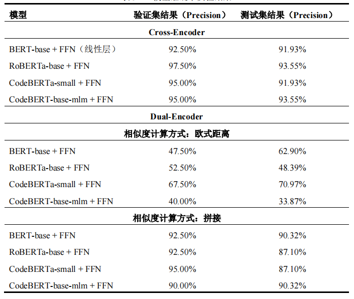
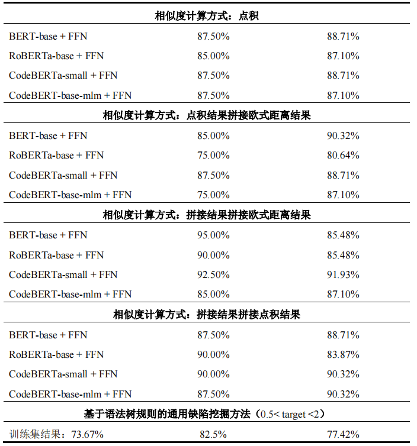

# FindGBugs
This project consists of two main parts, the first department is bugs_crawler and the second part is bugs_mining.

## bugs_crawler
The files in this folder are used for crawling, and they all end up fetching bugs in the form of <issue, commit>.

* oneRepoIWC.py

  This .py file is based on the full name of the repo to do the crawl only for this repo.

* getIWC.py

  This .py file does a query based on the keywords entered and does a crawl of all the repo's that are queried.

## bugs_mining

### 基于语法树规则的通用缺陷挖掘方法
This part is to propose a set of automated ways to dig the General Bug from the bugs obtained by the crawler above.It mainly uses python's abstract syntax tree. Based on the abstract syntax tree, a rule-based approach is used to mine the General Bug.
You need to run `clone_repo.py` to clone the Github repo to your own local before digging into the General Bug.
`update_nodes.py` is the starting position for digging the General Bug.

### 基于代码修复模式学习的通用缺陷挖掘方法

#### 基于Dual-Encoder的通用缺陷挖掘方法

使用两个编码器独立地对Buggy版本代码片段和Fix版本代码片段进行编码，然后使用点积等多种相似度计算方法计算两个代码向量表示的相似度，最后通过线性层对其分类。

#### 基于Cross-Encoder的通用缺陷挖掘方法

基于Cross-Encoder的通用缺陷挖掘方法首先将Buggy版本与Fix版本两段代码序列联合起来传递到CodeBERT中，通过Transformers（CodeBERT基本的网络结构，内部使用Self-Attention机制，即在编码一个Token的时候同时利用了其上下文的Token）的注意力头可以直接对两段代码间的交互进行建模，并输出两段代码的相关性分数，然后通过线性层对其分类。

### 实验结果

该研究使用Hugging Face开源的`Transforms`库中提供的用于编程和自然语言的预处理模型`CodeBERT-base-mlm`（网络层数为12层，每层有12个自注意头，隐藏层维度是768，模型参数的总数为125M），该模型在`CodeSearchNet`的代码语料库上完成预训练。本文构建的两种基于代码修复模式学习的通用缺陷挖掘模型使用AdamW优化器优化参数，相关参数设置为：β_1="0.9" ，β_2="0.99" ，?="1e-8" 。批（Batch）大小设为8，dropout值设为0.2。`CodeBERT`模型学习率设为 "2e-5" ，L2权重衰减参数设为0.01。为了保证训练过程的稳定，本文采用剃度剪裁策略限制最大梯度范数为1。基于代码修复模式学习的通用缺陷挖掘方法中的实验基于`PyTorch`深度学习框架，在NVIDIA GeForce RTX 2060（16G）显卡上完成模型训练。训练过程中采用早停（Early Stopping）策略，若模型在验证集上连续3个`Epoch`性能（以准确率为指标）没有提升，则终止训练，最后以验证集上性能最佳的模型用于测试集上的评估。

实验结果：

